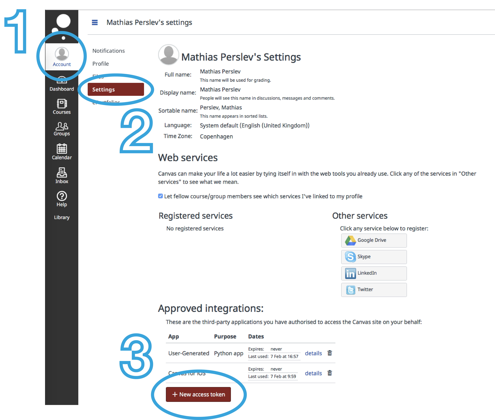

# Canvas-Sync

Automatically synchronize modules, assignments, and files from your Canvas LMS to your local computer.

## Overview

Canvas-Sync helps students stay organized by automatically synchronizing course content from their institution's Canvas server to a mirrored folder structure on their local machine. It traverses the Canvas folder hierarchy from the course level down to individual items, preserving the same folder structure locally:


### Key Features

- **Automatic Synchronization**: Download and organize all course modules, assignments, and files locally
- **Preserves Structure**: Creates a local folder hierarchy that matches your Canvas course organization  
  - Example: `./Canvas/Course Name/Module Name/SubFolder/file.txt`
- **Flexible Configuration**: Choose what to download:
  - Modules and module items
  - Assignments with descriptions and linked files
  - Canvas Pages (HTML)
  - External web links and file downloads
  - Files from the Files section
- **Smart Linking**: Automatically downloads external files referenced in assignment descriptions
- **Organized Output**: Categorizes files into logical folders; uncategorized items go to a 'Various Files' folder

## Requirements

- **Python 3.10+** (Python 2.7 support has been discontinued)
- Internet connection to access your Canvas institution

## Installation

### Using uv (Recommended)

```bash
uv pip install canvas-sync
```

Or add to your project:

```bash
uv add canvas-sync
```

### Using pip

```bash
pip install canvas-sync
```

### From Source

Clone the repository and install in development mode:

```bash
git clone https://github.com/Sang-Buster/Canvas-Sync.git
cd Canvas-Sync
pip install -e .
```

### Dependencies

Canvas-Sync automatically installs the following dependencies:

- **requests** - HTTP library for API communication
- **pycryptodome** - Encryption for storing credentials securely
- **py-bcrypt** - Password hashing for enhanced security

## Quick Start

### 1. Generate Canvas API Token

To authenticate with Canvas, you'll need an API token:

1. Log in to your Canvas instance
2. Go to **Account** → **Settings**
3. Scroll to **Approved Integrations** section
4. Click **New Access Token**
5. Give it a memorable name and save
6. Copy the token (you won't be able to see it again)



### 2. Launch Canvas-Sync

Run the command:

```bash
canvas
```

On first run, Canvas-Sync will prompt you to:
- Enter your Canvas instance URL
- Provide your API token
- Set a password to encrypt your credentials locally
- Choose your synchronization preferences
- Select your local sync folder

### 3. Configure Sync Options

You can customize:
- Which content types to download (files, pages, external links)
- Whether to synchronize assignments
- Whether to attempt downloading external files from assignment descriptions
- Sync folder location

### Command Line Options

```bash
canvas                    # Start sync with saved settings
canvas -s, --setup       # Reinitialize or update settings
canvas -i, --info        # Display currently saved settings  
canvas -S, --sync        # Force synchronization
canvas -h, --help        # Show help message
canvas -p <password>     # Specify password (use with caution)
```

## Security & Privacy

- Your Canvas API token is **encrypted locally** using a password you provide
- Credentials are **never shared** with third parties
- Canvas-Sync is **read-only** — it only downloads content, never modifies or deletes anything on Canvas
- Only the official version from GitHub is safe to use; modified versions could potentially misuse your credentials

## Important Notes

- Canvas-Sync is provided as-is; use at your own risk
- Initial sync may take time depending on course content volume
- Subsequent runs only download new or updated files for efficiency
- Some Canvas content may have access restrictions that prevent downloading

## Changelog

### v0.1.0 (May 7, 2026)
- Initial release with core synchronization features
- Support for modules, assignments, files, and external links
- Configurable sync options and secure credential storage
- Basic error handling and logging
- Command-line interface for easy use
- Extensible architecture for future enhancements
- Documentation and user guide
- Tested on Python 3.10+
  
## Development

### Setting Up Development Environment

```bash
# Clone the repository
git clone https://github.com/perslev/Canvas-Sync.git
cd Canvas-Sync

# Install dependencies with uv (recommended)
uv sync

# Activate the virtual environment
source .venv/bin/activate

# Run the CLI
canvas --help
```

### Project Structure

```
canvas-sync/
├── src/canvas_sync/          # Main package
│   ├── entities/             # Canvas entity classes (Course, Module, Assignment, etc.)
│   ├── settings/             # Settings and configuration management
│   ├── utilities/            # Helper functions and API interaction
│   └── cli.py                # Command-line interface (Typer-based)
├── pyproject.toml            # Modern Python packaging configuration
├── README.md                 # This file
└── docs/
    ├── ARCHITECTURE.md       # System architecture and design documentation
    └── images/               # Documentation images
```

### Architecture & Design

For an in-depth understanding of Canvas-Sync's architecture, class hierarchy, synchronization flow, and how the entity system works, see [docs/ARCHITECTURE.md](docs/ARCHITECTURE.md).

### Contributing

Found a bug or have a feature request? Please open an issue on GitHub:
https://github.com/Sang-Buster/Canvas-Sync/issues

## Additional Resources

- [Canvas by Instructure](https://www.instructure.com)
- [Canvas API Documentation](https://canvas.instructure.com/doc/api/index.html)
- [GitHub Repository](https://github.com/Sang-Buster/Canvas-Sync)

## License

See LICENSE.txt for details

---

**Last Updated**: May 2026 | **Version**: 0.2.4
